# 在 Rails 中使用 React 并实现 SSR 的一种实践

## 背景

这是我在公司内部所做的一次分享 (听众也有 PM，所以讲的内容不会很深入)。先说说背景，我为什么要做这次分享。

主要是我在一个 rails 项目中使用了 react 去渲染前端页面，且支持 SSR，但没有做前后端分离，想把一些经验做一些总结，以便将来也许可以用到其它项目中。

项目的具体内容在此略过。

这个项目刚开始做的时候，其实是一个很传统的 rails web 项目，前端页面在服务端通过 html 模板生成。

但是，做了一段时间后，客户有一些想法了：

1. 要用 react 来渲染前端页面，可能是因为他们觉得 react 很 cool 吧，而且当时在国外正流行。(没错，这是一个国外项目)
1. 必须支持 SEO (Search Engine Optimization)。(因为这是一个内容型网站)

我们知道，react 是一个客户端渲染 (Client Side Rendering, CSR) 的前端框架 (或者说是库)，但是如果我们要支持 SEO 的话，意味着同时必须做服务端染渲 (Server Side Rendering, SSR)。

方法之一，就是做前后端分离，把 rails 代码改造成只提供 API，然后在前面加一个 Node 的中间层做同构，可以用 Next.js 或 Express/Koa。

但当时的情况是，没有前后端分离的经验，也没做过 react 的服务端渲染，最重要的是，时间不够我们做这么大的改变。

所幸的是，经过短暂的调研，发现一个叫 [react-rails](https://github.com/reactjs/react-rails) 的 gem (当时的版本还是 1.10) 可以快速地满足我们的需求，支持在 rails 中使用 react，支持 SSR，且不需要前后端分离。

用法大概是这样子的。以我们后面要实现的页面为例，假设我们有一个显示电影信息的页面。

传统的 rails 代码是这样的：

    class MoviesController < ApplicationController
      def show
        @movie = Movie.find params[:id]
        # render 'show'
      end
    end

    # show.html.erb
    

      >
      

        <h1><%= @movie.title%></h1>
        
<%= @movie.desc %>

      

    

在 action 中从数据库取数据，然后再去 render html 模板。

用了 react-rails 后，在 action 中就不再是去 render html 模板，而是 render 一个 react component。代码如下：

    class MoviesController < ApplicationController
      def show
        @movie = Movie.find params[:id]
        render component: 'MovieItem',
               props: {
                 movie: @movie
               }
      end
    end

    # movie_item.jsx
    class MovieItem extends React.Component {
      render() {
        const { movie } = this.props
        return (
          

            
            

              <h1>{movie.title}</h1>
              
{movie.desc}

            

          

        )
      }
    }

或者另一种做法是，不修改 show action 的代码，还是让它渲染 show.html.erb，但在 show.html.erb 中删掉原来的模板，使用 react-rails 提供的 `react_component` view helper 方法来渲染 MovieItem component，如下所示：

    # show.html.erb
    <%= react_component('MovieItem', {movie: @movie}, {prerender: true}) %>

两者的区别是，前者默认做 SSR，即 `{prerender: true}`，后者可以通过第三个参数来选择做 SSR 还是不做 SSR，如果 prerender 为 false，则不做 SSR。

其原理是，当执行到 `react_component` 方法时，如果 prerender 为 false，就会简单地生成一个空的 div 标签，它包含 data-react-class 和 data-react-props 两个属性，前者用来存放要要渲染的 component 的名字，后者存放此 component 的 props。生成的 html 如下所示：

      <body>
    

      </body>

浏览器得到此 html，执行其中的 js 代码 (在 head 中引入)，js 代码可以从 data-react-class 和 data-react-props 属性中得知要渲染的 component 以及其 props，因此创建相应的 MovieItem component，并向其传递从 data-react-props 中解析得到的 props，调用其 render() 方法进行渲染。

如果 prerender 为 true，rails 会调起一个 JavaScript 的环境来把 MovieItem 的 render() 方法在服务器端先执行一遍，生成相应的 html 标签并返回给浏览器，生成的 html 如下所示：

      <body>

    

<h1>头号玩家 Ready Player One (2018)</h1>
在2045年，现实世界衰退破败，人们沉迷于VR(虚拟现实)游戏“绿洲(OASIS)”的虚幻世界里寻求慰藉。马克·里朗斯饰演的“绿洲”的创始人临终前宣布，将亿万身家全部留给寻获他隐藏的彩蛋的游戏玩家，史上最大规模的寻宝冒险就此展开，由泰伊·谢里丹饰演的男主角韦德·沃兹(Wade Watts/Parzival)和数十亿竞争者踏上奇妙而又危机重重的旅途。

      </body>

这种情况下，浏览器直接就可以把内容先展示出来，然后当 js 代码执行时，创建 MovieItem component 后，会再次执行 render() 方法，把这部分内容重新渲染一遍，但用户是感知不出来的。(具体实现的细节还有待探索)

所以，做 SSR 和不做 SSR 的区别之一是，做 SSR 时，因为 render() 方法首先会在服务端被执行一次，所以不能在 render() 方法中调用到任何浏览器相关的 API，比如 `window.location.href`，必须把它移到 componentDidMount() 中去调用。componentDidMount() 方法只会在浏览器端组件被加载后调用，在服务端不会被调用。

但是，可以从上面的代码看到，用 react-rails 后，不管做不做 SSR，我们需要渲染的数据都是直接在服务端获得的，并没有在客户端去发 ajax 请求拿数据的逻辑，所以并没有前后端分离。在这里，我们仅仅是用 react component 去替代了原来的 html 模板，渲染 props 传过来的数据，相当于是一个 PureComponent，实现了 React 所宣称的它只是一个很薄的 view 层。

所以，借助 react-rails 后，我们的工作就简单多了，就是把一个个 html 模板替换成 react component，什么 redux，react-router，统统都没去用。

相比传统的 html 模板渲染，react component 的 SSR 渲染可能效率会低一些，毕竟要再起一个 JavaScript 环境去做这个事情。

但相比写传统的 html 模板代码，我还更愿意也更擅长写 react 代码，心里还是美滋滋的。

但是，此时的 react-rails 有一个大坑，从上面 MovieItem 的实现也可以看出，它没有 export，因为每一个 react component 默认都是全局可见的，也没有 import，因为它压根就不能使用 npm 包，因此也没有一个 package.json 的文件。

这意味着，我们必须要自己手动实现每一个 component。这很让人头疼，也是我做这个项目时心头一直的一个痛。就担心哪天要实现一个很复杂的组件，就不知道该怎么办了。

但直到上个月，都一直还 OK，大部分组件都不是很复杂，还能 hold 得住，如果有别人实现过的组件，比如 star rating，auto size textarea，就参考别人的实现，把别人的代码翻译简化一下，不复杂的就自己实现，比如 collapse。

直到有一天，我们的设计稿上出现了一个 range slider，略复杂，网上也找到了几乎一样的实现 - [rc-slider](http://react-component.github.io/slider/examples/handle.html)，看了一下它的源码，首先，源码就很复杂，然后它又依赖了 rc-tooltip 等一堆 npm 包，这完全 copy 不动啊... 我们也承担不起花费很多时间去重新实现这么一个组件。

所以我们就开始思考怎么来彻底解决这个痛 - 在 rails 中使用 npm 包。

好消息是，在今天，这个方法并不难 (webpacker)，但在一年多前，我们刚开始使用 react-rails 的时候，那时候还是一个难点。react-rails 中的有一些讨论如何使用第三方库的 issue：

- [How do you require react-modal in your app?](https://github.com/reactjs/react-rails/issues/510)
- [How do you manage dependencies?](https://github.com/reactjs/react-rails/issues/135)

有一些 workaround，比如使用 rails assets gem，或者将第三方库编译后的代码放到 app/assets/javascripts/vendor 目录下 ... 但都不是很完美的解决方案。[browserify-rails](https://github.com/browserify-rails/browserify-rails) 是最近才知道的，但有了 webpacker 后就没有研究了。

几个月前 (好像是吧)，rails 发布了 [webpacker](https://github.com/rails/webpacker) gem，把前端的打包工具 webpack 整合进 rails，有了它，我们就可以方便地在 rails 中使用各种前端框架，react / vue / angular / stimulus ... 和使用 npm 包。

新版本的 react-rails (2.4.4) 也可以很好地和 webpacker 配合使用，因此果断地将 react-rails 从 1.10 升级到 2.4.4，并引入 webpacker。

当然，升级过程总是痛苦的，踩了各种坑，花了好几天才升级完毕。react-rails 的错误信息提示是个大问题，如果一个组件里面包裹了多层子组件，最里面的子组件写错了，它只会说最外层组件出错了，你不知道具体错在哪，只能一层一层排除。错误信息也不够明确，路径写错了，是 "Element tyep is invalid"，变量重复定义，也是这个错，什么有价值的信息也没有，不会告诉你是哪个文件找不到，哪个变量重复定义。吐槽一下。

    Encountered error "#<ExecJS::ProgramError: Invariant Violation: Element type is invalid: expected a string (for built-in components) or a class/function (for composite components) but got: undefined. You likely forgot to export your component from the file it's defined in, or you might have mixed up default and named imports.>" when prerendering HelloWorld with {"greeting":"Hello"}

升级改造完成后，`yarn install rc-slider`，改改样式，range slider 就搞定了，一个心头的痛总算是搞定了。

总结就是，webpacker 支持我们在 rails 中使用 npm 包和 react，reac-rails 支持对 react 做 SSR。

以上就是背景，接下来终于要进入主题，以下是我要讲的内容提纲。

## Content Table

1. What's SSR (server side rendering) & CSR (client side rendering), comparison
1. What's SEO (search engine optimization), How search engine works
1. CSR's drawbacks (SEO not friendly & blank first screen)
1. Demo webpacker to support use react in rails
   - Setup webpacker
   - Implement SSR / CSR examples (MoviesController)
1. Demo use third party npm packages (react-stars)
1. Demo blank first screen and workaround (loading status)
1. Demo react-rails to support SSR for react
1. Summary

(当初准备的是英文分享，这部分就懒得翻译了)

前面两小节是用来给 PM 普及一下基础知识，开发人员可以略过。

## SSR & CSR

首先，我准备了一个 demo，展示两个简单的页面，一个是传统的 SSR 页面，一个是 CSR 页面。

它们在浏览器中看上去是一模一样，实际也确实如此。

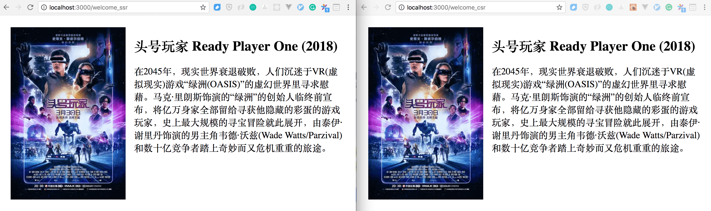

但这只是表面现象，我们要透过现象看本质，来看一下它们的源码。

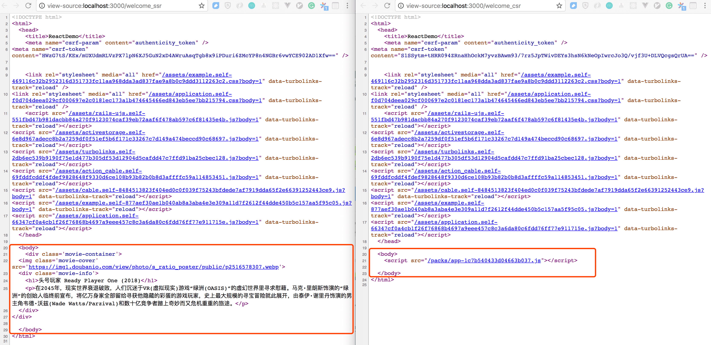

左侧的 SSR 页面，源码 body 中的内容，和我们在浏览器中看到的是一样的，这些内容在服务器就生成好了。

而右侧的 CSR 页面，源码 body 中除了一个 js 文件，空空如也，那浏览器中我们看到的 img, h1, p 是从哪来的呢，那很明显只能是由 js 代码在客户端这边生成的了。

所以，前者就是所谓的服务端渲染，html 中的内容主要在服务端生成；而后者就是客户端渲染，html 中的内容主要在客户端生成。

## SEO

SEO 是 search engine optimization 的缩写，意为搜索引擎优化，意思是说，如何优化你的网页内容或结构，当用户搜索相关的关键字时，能使我们的网页在搜索结果中排得越前，这样我们就能获得更多的流量。这其实是一门挺大的学问。

那搜索引擎到底是怎么工作的呢，为什么我们在 Google 中搜索一些关键字，就能找到相关的网页呢。

这是因为每一个搜索引擎都有自己的 spider，即网络爬虫，这些爬虫不停地在爬取全世界所有的网页，然后解析和提取其中的文本内容，然后存到自己的数据库中。

需要注意的一点是，spider 不会去执行网页上的 js 代码，它完全不关心 js 代码和 css 样式。

让我们来对比一下 spider 是如何解析 SSR 页面和 CSR 页面的。

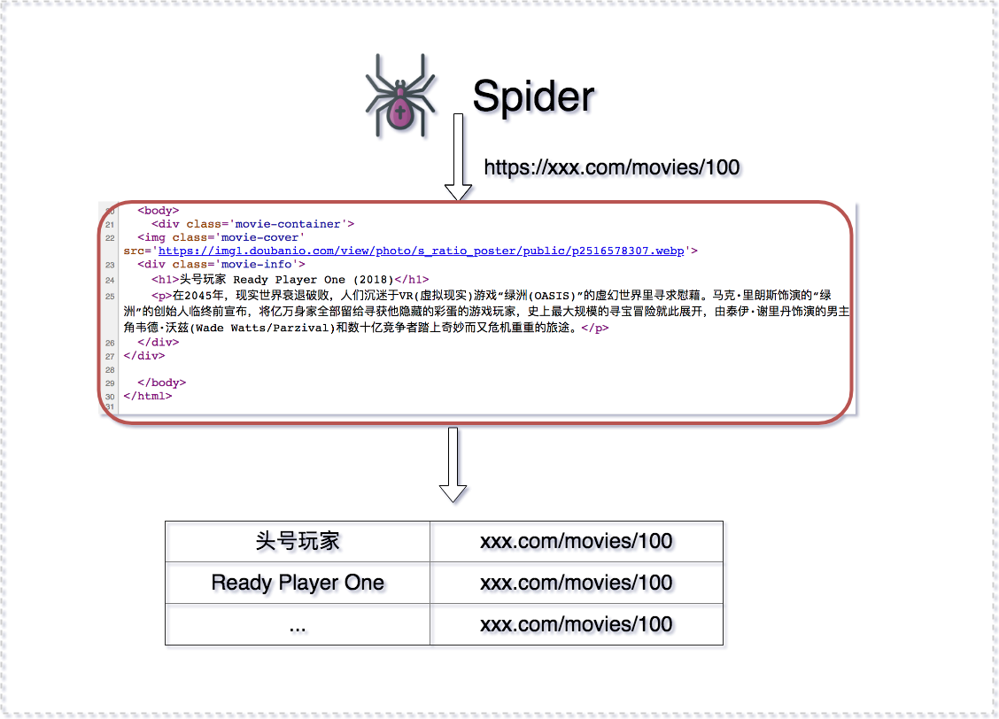

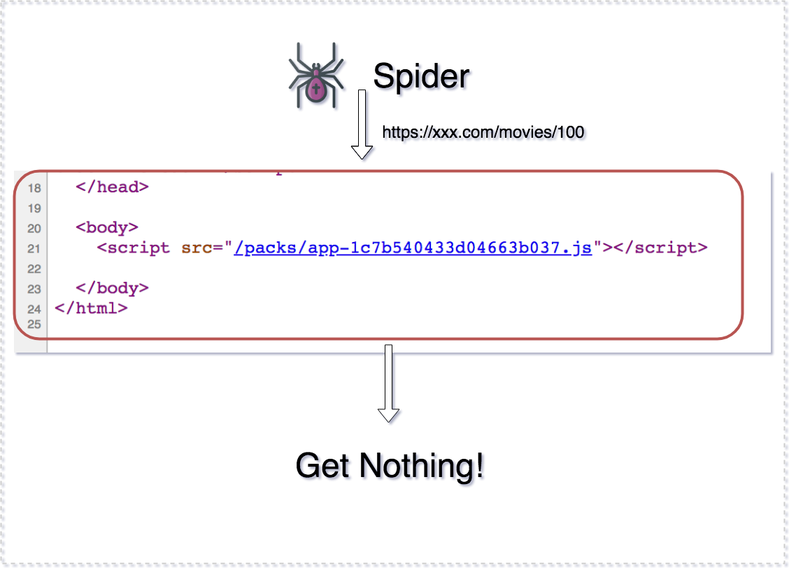

从上面的对比可以看出，CSR 页面对 SEO 是不友好的，因为 spider 无法从中得到有效的信息，抽取不出什么关键字，因此我们无法通过搜索引擎检索到这个网页。

一般来说，内容型的网页需要关心 SEO，比如 blog 类，新闻类网站。而另外一些则可以完全不用考虑 SEO 的问题，尤其是需要登录访问的网站，比如后台管理，论坛，社交网站 ...

## CSR 的缺点

主要有两个缺点，一是对 SEO 不友好，前面已经解释了。其二是首屏白屏的问题。

我同样准备了一个 demo，先让大家大致对这个首屏白屏现象有个体会。假设我们服务端的程序特别慢，从数据库查询数据要很久，我们用 sleep 5s 来模拟这种情况，然后来对比一下访问 SSR 页面和 CSR 页面的感受，和所观察到的现象。

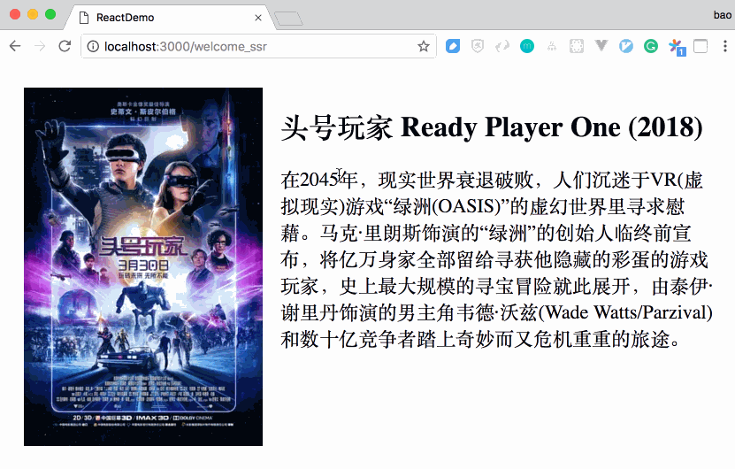

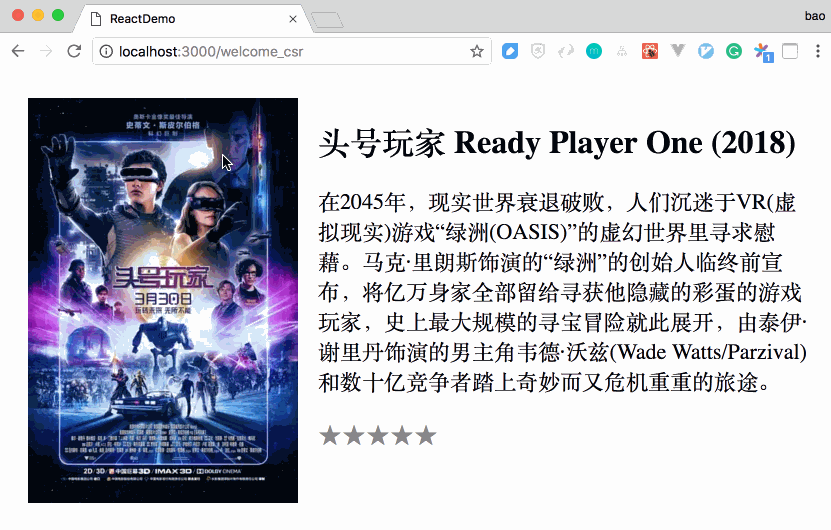

两者的对比是很明显的，对于 SSR 页面的访问，在浏览器上有一个长达数秒的 loading 状态，表明还在从服务器下载网页中，只要一下载回来，网页内容就会马上显示，但在显示之前，网页内容是保持不变的。

对于 CSR 页面的访问，从服务器下载网页倒是很快，因为浏览器几乎没有 loading 状态，但下载回来后，js 再发 ajax 请求去获取数据，在数据回来之前，这中间有一个长达数秒的白屏现象。这给用户造成了一定的困扰，体验很不好。

这就是所谓的首屏白屏现象，我们后面会讲到如何来解决这个问题。

## Demo webpacker to support use react in rails

### Setup webpacker

OK，前面讲了一些理论，接下来我们终于可以开始来进行一些实战了。我们的目标就是来一步一步实现前面展示的两个页面，一种用传统的 SSR 来实现，一种用 react 的 CSR 来实现，进行对比，最后再对后者进行 SSR。

首先，我们创建一个新的 rails 项目。

    $ rails new react-demo
    $ cd react-demo

然后，我们根据 webpacker 的文档，把 webpacker 安装并配置好。

第一步是在 Gemfile 里声明 webpacker gem。

    # Gemfile
    gem 'webpacker', '~> 3.4'

然后执行 bundle 安装。

接着，执行 `bin/rails webpacker:install` 命令，这个命令会生成很多 webpack 的配置文件，我们暂时不用关心，用默认配置就行，如果想要定制的话，那还得先去学学 webpack。

需要关心的是，这个命令直接在 app 目录层级下创建了 javascript/packs 目录，我们的 js 代码就放在这里，而不像以前是放在 app/assets/javascripts 目录下。从目录层级来看，它相当于提升了一层，不再是和 images / css style 一起作为 assets 看待，而是和 controllers / models 一个层级。

另外，生成的文件还有 package.json，有了这个文件的出现，意味着我们就可以开始自由地使用 npm 包了。

webpacker 是支持多种前端框架的，比如 react / vue / angular / stimulus / elm 等等，在这里，我当然选择使用 react 啦。

所以，我们接着执行 `bin/rails webpacker:install:react` 引入 react。

执行这个命令后，可以看到 package.json 中就增加了对 react，react-dom 依赖了，同时在 .babelrc 中增加了对 react 的支持，这样 babel 就能转换 jsx 语法了。

    // package.json
    "name": "react-demo",
    "private": true,
    "dependencies": {
      "@rails/webpacker": "3.4"
      "@rails/webpacker": "3.4",
      "babel-preset-react": "^6.24.1",
      "prop-types": "^15.6.1",
      "react": "^16.3.2",
      "react-dom": "^16.3.2"
    },

同时生成了一个 react component 示例，在 app/javascript/packs/hello_react.jsx 中，稍候我们会讲如何把它展示出来。

### Implement SSR / CSR example

#### Create Movie model

我们想要显示电影信息的页面，所以我们先来创建一个 Movie model，设置 `cover_img`, title, desc 三个属性。

    $ bin/rails g model Movie cover_img:string title:string desc:text
    $ bin/rails db:migrate

接着，我们给这个 movies 表填充点数据，我们修改 db/seeds.rb 文件。

    # db/seeds.rb
    # movie data comes from movie.douban.com
    Movie.create([
      {
        cover_img: 'https://img1.doubanio.com/view/photo/s_ratio_poster/public/p2516578307.webp',
        title: '头号玩家 Ready Player One (2018)',
        desc: '在2045年，现实世界衰退破败，人们沉迷于VR(虚拟现实)游戏“绿洲(OASIS)”的虚幻世界里寻求慰藉。马克·里朗斯饰演的“绿洲”的创始人临终前宣布，将亿万身家全部留给寻获他隐藏的彩蛋的游戏玩家，史上最大规模的寻宝冒险就此展开，由泰伊·谢里丹饰演的男主角韦德·沃兹(Wade Watts/Parzival)和数十亿竞争者踏上奇妙而又危机重重的旅途。'
      },
      {
        cover_img: 'https://img1.doubanio.com/view/photo/s_ratio_poster/public/p2516914607.webp',
        title: '湮灭 Annihilation (2018)',
        desc: '莉娜（娜塔莉·波特曼 Natalie Portman 饰）是一名生物学家，一年前，她的丈夫凯恩（奥斯卡·伊萨克 Oscar Isaac 饰）在参加一项秘密任务后神秘失踪，这一年间，莉娜一直生活在悲伤之中。某天，失忆的凯恩忽然出现在了莉娜的面前，之后晕倒被送入了医院。在那里，莉娜遇见了文崔斯博士（詹妮弗·杰森·李 Jennifer Jason Leigh 饰）。'
      }
    ])

然后执行 `bin/rails db:seed` 填充数据。

进入 rails 控制台看一下数据是不是已经有了。

    $ bin/rails c
    2.3.3 :001 > Movie.all
      Movie Load (11.4ms)  SELECT  "movies".* FROM "movies" LIMIT ?  [["LIMIT", 11]]
    => #<ActiveRecord::Relation [#<Movie id: 1, cover_img: "https://img1.doubanio.com/view/photo/s_ratio_poste...", title: "头号玩家 Ready Player One (2018)", desc: "在2045年，现实世界衰退破败，人们沉迷于VR(虚拟现实)游戏“绿洲(OASIS)”的虚幻世界里寻求...", created_at: "2018-04-20 14:05:25", updated_at: "2018-04-20 14:05:25">, #<Movie id: 2, cover_img: "https://img1.doubanio.com/view/photo/s_ratio_poste...", title: "湮灭 Annihilation (2018)", desc: "莉娜（娜塔莉·波特曼 Natalie Portman 饰）是一名生物学家，一年前，她的丈夫凯恩（奥斯...", created_at: "2018-04-20 14:05:25", updated_at: "2018-04-20 14:05:25">]>

#### Create Movies controller

然后我们创建 Movies controller，并且为它生成 ssr 和 csr 两个 action。

    $ bin/rails g controller Movies ssr csr

至此，准备工作完毕。

#### Implement SSR page

我们首先用传统的 SSR 来实现一个显示电影信息的页面。我们让它显示 id 为 1 的 movie 信息。

修改 MoviesController 的 ssr action。

    class MoviesController < ApplicationController
      def ssr
        @movie = Movie.find 1
      end
      ...
    end

修改相应的 view 模板 ssr.html.erb。

    

      >
      

        <h1><%= @movie.title%></h1>
        
<%= @movie.desc %>

      

    

执行 `bin/rails s` 启动 rails，访问 `localhost:3000/movies/ssr`。

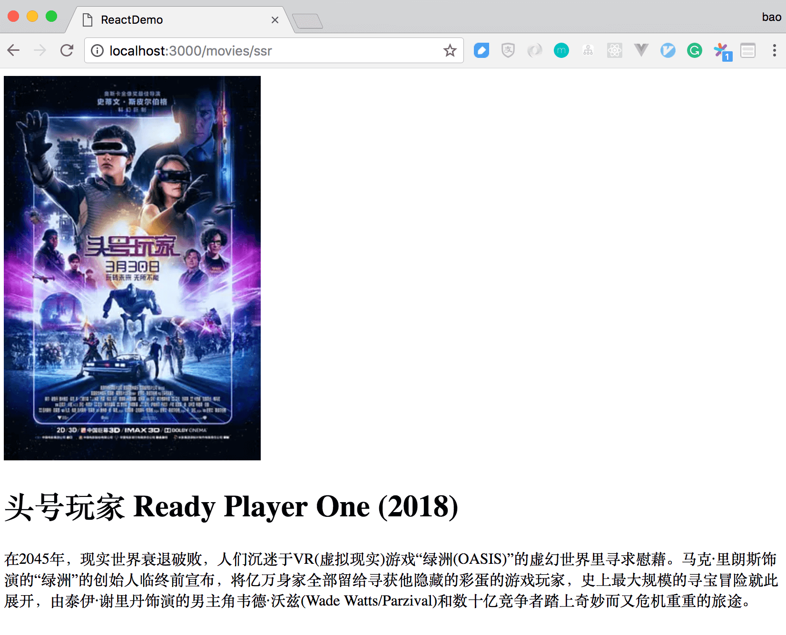

给它加点 css style，修改 app/assets/stylesheets/movies.scss 文件。

    .movie-container {
      display: flex;
      padding: 20px;

      .movie-info {
        margin-left: 20px;
        width: 600px;

        p {
          font-size: 22px;
        }
      }
    }

刷新一下再看效果，至此，一个 SSR 页面就完成了。

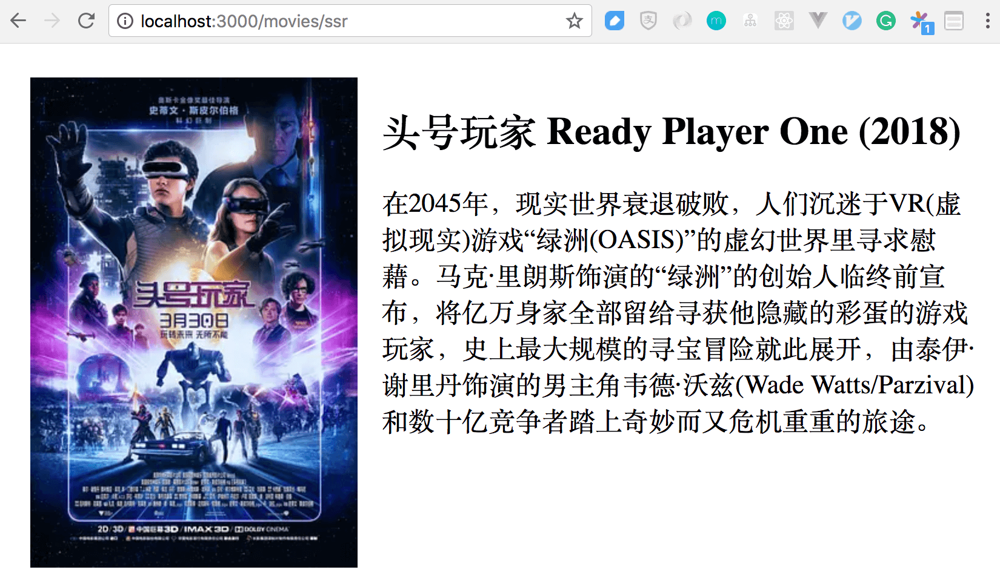

### Implement CSR page

我们前面说到，生成了一个示例 react component 文件 `hello_react.jsx`，我们来看一下它的内容。

    import React from 'react'
    import ReactDOM from 'react-dom'
    import PropTypes from 'prop-types'

    const Hello = props => (
      
Hello {props.name}!

    )

    Hello.defaultProps = {
      name: 'David'
    }

    Hello.propTypes = {
      name: PropTypes.string
    }

    document.addEventListener('DOMContentLoaded', () => {
      ReactDOM.render(
        <Hello name="React" />,
        document.body.appendChild(document.createElement('div')),
      )
    })

在这个文件中，定义了一个 Hello 的 component，并且监听 document 的 DOMContentLoaded 事件，在这个事件触发时，将创建一个 div 的 DOM element，把这个 element append 到 document.body 中，并且在这个 div element 中，渲染 Hello component。

我们只需要把这段 js 代码包含到 view 模板中，浏览器将会执行这段代码从而把 Hello component 展示出来。

我们修改 csr.html.erb，删掉原来的代码，让它仅仅包含 `hello_react.jsx` 的代码。我们知道有一个 `javascript_include_tag` 的 view helper 方法，它是用来引入 app/assets/javascripts 目录中的 js 文件，如果要引入 app/javascript/packs 目录下的 js 文件，我们使用 `javascript_pack_tag` view helper 方法。

    <%= javascript_pack_tag 'hello_react' %>

访问 `localhost:3000/movies/csr`，效果如下。

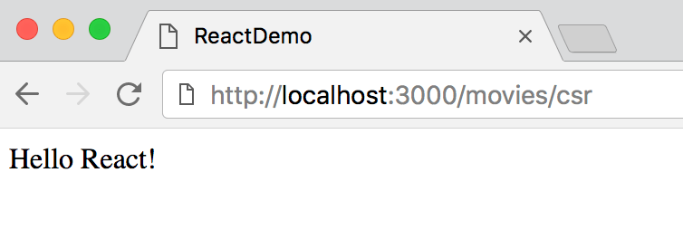

接下来，我们把这个默认的 Hello component 替换成我们自己定义的 MovieItem component。

我们创建一个新的文件 `movie_item.jsx`，实现 MovieItem component，代码如下。

    import React from 'react'
    import PropTypes from 'prop-types'

    export default class MovieItem extends React.Component {
      constructor(props) {
        super(props)

        this.state = {
          movie: null
        }
      }

      componentDidMount() {
        fetch('/movies/1')
          .then(res => res.json())
          .then(movie => this.setState({movie}))
      }

      render() {
        const { movie } = this.state
        if (movie) {
          return (
            

              
              

                <h1>{movie.title}</h1>
                
{movie.desc}

              

            

          )
        }
        return null
      }
    }

这个 MovieItem 内部有一个存放 movie 的 state，一开始它的值当然是 null，当组件被加载后，它将发送一个 ajax 请求去服务器请求 id 为 1 的电影数据。在 render() 函数中，当 movie 有值时，我们渲染电影信息，否则，什么都不显示。

接下来我们需要在服务端实现这个 `GET /movies/1` 的 API，以支持客户端的 ajax 请求。

`GET /movies/1` 对应的是 MoviesController 的 show action，我们给 MoviesController 加上这个路由并实现 show action。

修改 routes.rb。

    resources :movies

实现 show action，因为这是一个 API，所以返回值应该是 json。

    class MoviesController < ApplicationController
      def show
        movie = Movie.find params[:id]
        render json: movie
      end
      ...
    end

我们在浏览器中访问这个 API `localhost:3000/movies/1` 测试一下，得到了预期值。

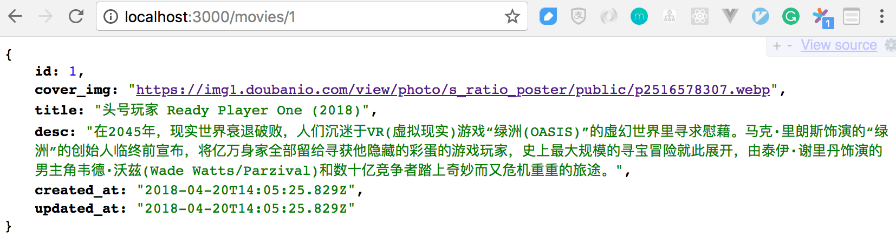

最后，我们修改 `hello_react.jsx`，将加载的 component 由 Hello 换成 MovieItem。

    import MovieItem from './movie_item'

    document.addEventListener('DOMContentLoaded', () => {
      ReactDOM.render(
        <MovieItem />,
        document.body.appendChild(document.createElement('div')),
      )
    })

访问 `localhost:3000/movies/csr` 看一下结果。

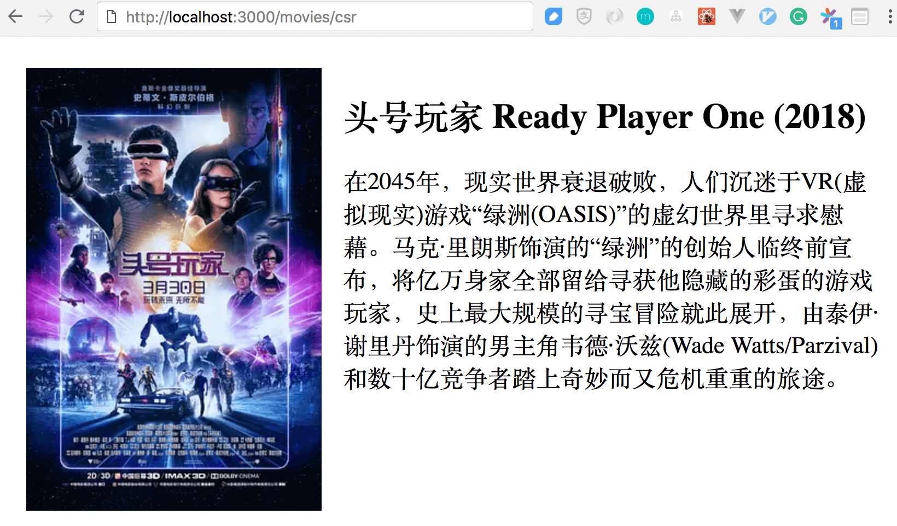

再看一下它的网页源码。

      ...
      <body>
        

      </body>
    </html>

body 里确实除了一个 js 文件外什么都没有。

## Demo use third party npm packages (react-stars)

我们前面说到，webpacker 带来的最大好处是，我们可以方便地使用丰富的 npm 包，方便地使用别人实现的组件，而不用我们自己手动实现。

我们想在这个电影页面上增加一个 star rating 的组件，用来支持用户给电影评分。我们用关键字 `react star rating` 进行 google，可以搜到大量别人已经实现好的 star rating 组件，我们选择 [react-stars](https://github.com/n49/react-stars) 这个 npm 包。

首先，安装这个 npm 包。

    $ yarn add react-stars

然后，就可以直接使用了，根据 react-stars 的文件，我们修改 `movie_item.jsx`。

    import ReactStars from 'react-stars'

    export default class MovieItem extends React.Component {

      // ...
      render() {
          ...
          return (
            

              
              

                <h1>{movie.title}</h1>
                
{movie.desc}

                <ReactStars count={5}
                            size={48}
                            color2={'#ffd700'} />
              

            

          )
        }

刷新 `localhost:3000/movies/csr` 看一下效果。

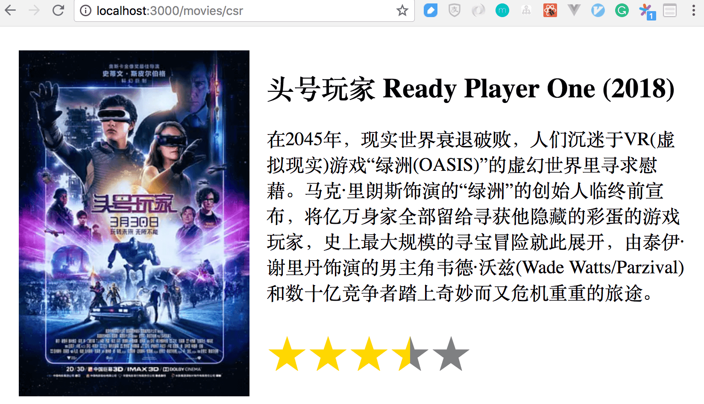

## Demo blank first screen and workaround (loading status)

前面我们已经对 CSR 的首屏白屏现象有了一点了解。我们现来 demo 一下这种现象是怎么产生的。

假设服务端端的程序性能很低，数据库查询需要 5s 才能返回结果，我们用 `sleep 5` 来模拟这种情况。

修改 MoviesController 代码。

    class MoviesController < ApplicationController
      ...
      def ssr
        sleep 5
        @movie = Movie.find 1
      end

      def show
        sleep 5
        movie = Movie.find params[:id]
        render json: movie
      end
    end

对比效果 (直接用了前面的截图)。

解决 CSR 首屏白屏现象的一个简单的 workaround 的办法就是，数据还没有返回时，显示一个 loading 的状态，以安抚用户。

修改 `movie_item.jsx`，在 movie 为 null 时，显示 loading 状态。

    render() {
      const { movie } = this.state
      if (movie) {
        return (
          ...
        )
      }
      return <h1>I am loading... please don't leave me!</h1>
    }

刷新看一下效果。

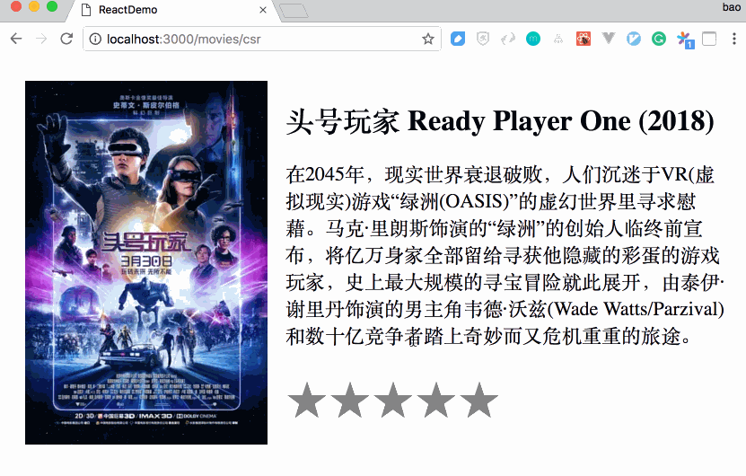

## Demo react-rails to support SSR for react

到目前为止，我们已经认识到了 CSR 的两大缺点，一是对 SEO 不友好，二是首屏白屏现象。而这两个缺点在传统的 SSR 上都不存在。因此，人们就在想，能不能把两者结合起来，先在服务端把首屏渲染一遍，然后再由浏览器端重新渲染一次以及渲染后面更多的页面。

接下来我们就来 demo 如何用 react-rails 来帮我们做这样的事情。

首先我们来安装这个 gem，修改 Gemfile，然后再 bundle。

    gem 'react-rails'

根据 react-rails 的文档，执行 `bin/rails g react:install` 命令。

执行完这条命令后，在 app/javascripts 目录下生成了一个 components 目录，同时，application.js 被修改了，增加了 `server_rendering.js` 文件，文件内容和 application.js 是一样的。

    // application.js
    var componentRequireContext = require.context("components", true)
    var ReactRailsUJS = require("react_ujs")
    ReactRailsUJS.useContext(componentRequireContext)

这几行代码大致是说 react-rails 会从 components 目录中寻找相应的 component。所以我们要把原来的 `movie_item.jsx` 从 app/javascript/packs 目录移动到 app/javascript/components 目录下。

同时，application.js 成为 js 代码的入口，因此我们要修改 csr.html.erb。

    <%= javascript_pack_tag 'application' %>

(在实际项目中，应该把这一行代码放到 application.html.erb 中，让每一个页面都包含这些 js 代码，但这里我为了对比 SSR 和 CSR，ssr.html.erb 页面并不需要这些 js，所以把它只放在 csr.html.erb 中)

然后，因为我们要做 SSR，所以数据很显然要在服务端产生，我们修改 csr action，在这个 action 中直接从数据库中取得 movie 数据，同时，为了检验它能否解决首屏白屏的问题，我们也加上 `sleep 5`。

    def csr
      sleep 5
      @movie = Movie.find 1
    end

我们在服务端就拿到 movie 数据，很显然我们要把它传递给 MovieItem component，我们修改 MovieItem 的代码，让它接受一个 movie 的 props，又因为我们已经在服务端就拿到了 movie 数据，因此就不需要再发 ajax 请求来取数据了。

    export default class MovieItem extends React.Component {
      // constructor(props) {
      //   super(props)

      //   this.state = {
      //     movie: null
      //   }
      // }

      // don't need any more
      // componentDidMount() {
      //   fetch('/movies/1')
      //     .then(res => res.json())
      //     .then(movie => this.setState({movie}))
      // }

      render() {
        const { movie } = this.props
        if (movie) {
          return (
            

              
              

                <h1>{movie.title}</h1>
                
{movie.desc}

                <ReactStars count={5}
                            size={48}
                            color2={'#ffd700'} />
              

            

          )
        }
        return 
no movie!

      }
    }

    MovieItem.propTypes = {
      movie: PropTypes.object
    }

ok，接下来就到了最关键的一步了，到目前为止，我们还没有在任何地方声明渲染 MovieItem 这个 component 呢。react-rails 提供了一个 `react_component` 的 view helper 方法来渲染一个 react 组件。

因此，我们在 csr.html.erb 中加入这行代码。

    <%= react_compoent('movie_item', {movie: @movie}, {prerender: true}) >

第一个参数是声明要渲染的组件名 (其实是组件所在的文件名)，第二个参数是此组件的 props，第三个是声明是否做 SSR，我们设置为 true。

我们前面说到，当 rails 执行到 `react_component` 方法，且 prerender 为 true 时，它会调用一个 JavaScript 的环境来去执行相应组件的 render() 方法，得到相应的 html 内容，插入在此处。

我们重启 rails 并重新访问 `localhost:3000/movies/csr` 看看效果。

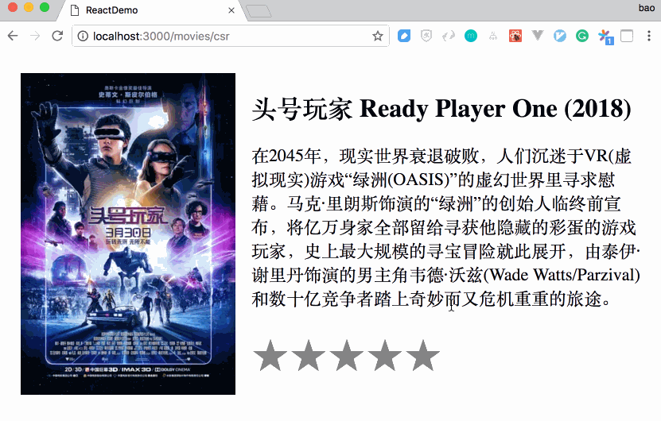

可见，首屏白屏现象已经消失了。

再来看一下它的源码。

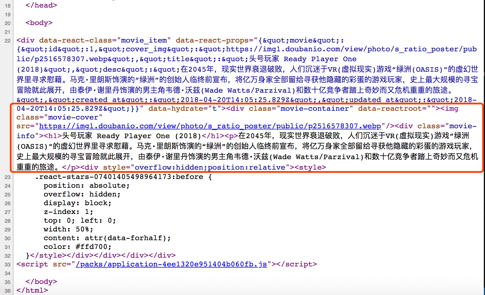

源码中已经包含搜索引擎 spider 所需要的内容，所以它也解决了对 SEO 不友好的问题。

## 总结

借助 webpacker 和 react-rails，我们可以在不做前后端分离的情况下，方便地在 rails 中使用 react 来渲染 view，且支持 SSR，可以使用 npm 包。
